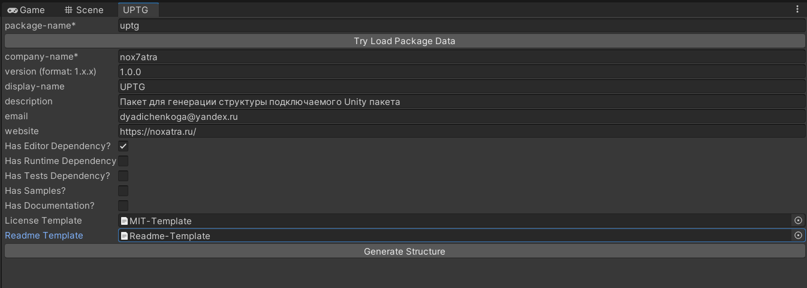

# Unity Package Template Generator
## nox7atra dyadichenkoga@yandex.ru

Пакет для генерации структуры подключаемого Unity пакета

Установка через Unity Package Manager / Add package from git URL: https://github.com/Nox7atra/UPTG.git?path=/Assets/uptg

Чтобы открыть окно в верхней панели выберите PackageTemplateGenerator->Show

Для редактирования существующих пакетов укажите имя пакета и нажмите Try Load Package Data 

В пакете так же лежат шаблоны базового ридми и MIT лицензии, но можно сделать свои или отредактировать после создания

Необходимые референсы в asmdef файлы нужно прокидывать самостоятельно
